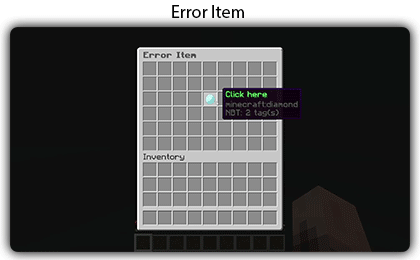
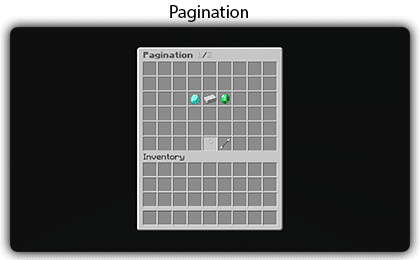
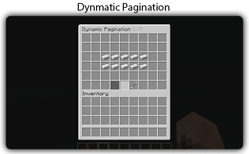
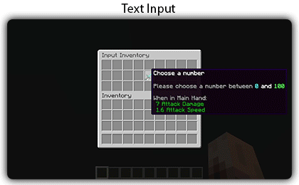

# ⏹️ 按钮

## 信息

按钮允许你 <mark style="color:green;">自定义</mark> 你菜单中的操作。你需要指定每个按钮的类型，并配置特定于该按钮类型的元素。下面是插件默认集成的按钮类型；其他插件也可以添加新的按钮类型。

对于每个按钮，你必须指定一个 `Item`。要了解如何配置 `Item`，请访问 [这里](../items.md)。

## 配置

以下是所有类型的按钮共有的配置元素。你可以在不同的按钮类型中通用地使用这些元素。

```yaml
example:
  # 选择按钮类型，默认值为 NONE
  type: <button type>
  # 设置按钮的槽位，默认值为 0
  slot: <slot>
  # 设置按钮的多个槽位，默认值为空
  slots: <list of slot>
  # 设置按钮所在的页码，默认值为 1
  page: <page>
  # 定义按钮是否应该在所有页面上出现
  isPermanent: <true or false>
  # 显示的物品，请查看物品文档
  item: <itemstack>
  # 点击时播放的声音
  sound: <sound from XSound>
  # 声音音量
  volume: <volume of sound>
  # 声音音调
  pitch: <pitch of sound>
  # 点击时发送的消息
  messages: <list of messages>
  # 消息列表中显示的链接
  openLink:
    link: <link>
    message: <message>
    replace: <replace placeholder>
    hover: <list of messages>
  # 点击时关闭菜单
  closeInventory: <true or false>
  # 点击时刷新物品名称和描述
  refreshOnClick: <true or false>
  # 显示玩家头像，需要占位符或玩家名称
  playerHead: <placeholder>
  # 你可以设置一个或多个权限来显示该物品
  permission: <permission>
  # 如果未检查（占位符检查、权限或其他），显示另一个按钮
  else: <else button>
  # 占位符
  placeholder: <placeholder>
  # 占位符值
  value: <value for placeholder>
  # 占位符操作
  action: <action for placeholder>
  # 占位符列表
  placeholders: <list of placeholder>
  # 点击时更新按钮（更新所有内容）
  update: <boolean>
  # 玩家发送的指令
  commands: <list of text>
  # 控制台点击时发送的指令
  consoleCommands: <list of text>
  # 控制台右击时发送的指令
  consoleRightCommands: <list of text>
  # 控制台左击时发送的指令
  consoleLeftCommands: <list of text>
  consolePermissionCommands: <list of text>
  consolePermission: <permissions>
  # 点击时更新物品名称和描述
  updateOnClick: <boolean>
  # 设置玩家应该具备的要求以查看按钮
  view_requirement: <requirement>
  # 设置玩家应该具备的要求以点击按钮
  click_requirement: <requirement>
```

### 类型

```yaml
type: <button type>
```

按钮的类型。默认情况下，类型将设置为 `NONE`。如果你想执行特定的操作，设置按钮类型是很重要的。

***

### 槽位

```yaml
slot: <number between 0 and inventory limit>
```

```yaml
slot: <page>-<slot>
```

指定物品显示的槽位。


* 槽位从 0 开始。
* 你可以直接在槽位中指定页码。格式应该是：`<page>-<slot>`。例如，页面 2 和槽位 8 的按钮，可以使用：`2-8`。
* 要在同一槽位放置多个物品，你必须使用 `else` 按钮。


<figure><figcaption><p>双箱槽位</p></figcaption></figure>

要在多个槽位中显示按钮，可以这样做：

```yaml
slots:
  - 0
  - 1
  - 2
  - 3
  - 4
  ...
```

你还可以使用以下格式创建槽位范围：`<startslot>-<endslot>`。

```yaml
slots:
  - 0-9 # 从槽位 0 到槽位 9
  - 18
  - 17
  - 26
  - 27
  - 35
  - 36
  - 44-53 # 从槽位 44 到 53
```

***

### 页面

```yaml
page: <page number>
```

允许你指定按钮将显示的页面。默认情况下，页面设置为 1。

***

### 是否永久

```yaml
isPermanent: <true or false>
```

允许你指定按钮是否应显示在菜单的所有页面上。如果你的菜单只有一页，你不需要使用此选项。

***

### 使用缓存

```yaml
useCache: <true or false>
```

允许你启用或禁用物品的缓存。如果按钮物品不包含占位符，默认情况下将始终使用缓存。

***

### 物品

```yaml
item: <itemstack>
```

允许你指定将显示的物品。有关更多信息，请点击 [这里](https://zmenu.groupez.dev/configurations/items)。

***

### 声音

```yaml
sound: ENTITY_COW_HURT
pitch: 1.5
volume: 0.5
```

允许你在玩家点击时播放声音。你必须使用 [XSound](./) 中可用的声音。你还可以调整声音的音调和音量。

***

### 消息

```yaml
messages:
  - <line 1>
  - <line 2>
  ...
```

允许你在点击时向玩家发送消息列表。你可以使用 [MiniMessage](https://docs.advntr.dev/minimessage/format.html) 格式发送具有点击或悬停操作的消息。

***

### 打开链接

```yaml
link: <link>
message: <message>
replace: <replace string>
hover:
  - <line 1>
  - <line 2>
  ...
```

允许你向玩家发送可点击的消息。你需要在消息列表中包括一个文本，该文本将被可点击的链接替代。下面是一个示例。


请仅在你的服务器运行较旧版本的 Minecraft 时使用此功能。否则，请使用 [MiniMessage](https://docs.advntr.dev/minimessage/format.html) 格式，它更易于使用。


> 示例：

```yaml
messages:
  - "&8(&6zMenu&8) &f将你的服务器添加到网站 &3Serveur Minecraft Vote"
  - "&8(&6zMenu&8) %link% &d!"
openLink:
  link: "https://serveur-minecraft-vote.fr/utiliser/un/code/cadeau?code=ZMENU"
  message: "&b&l点击这里"
  replace: "%link%"
  hover:
    - "&b点击这里！"
```

***

### 关闭菜单

```yaml
closeInventory: <true or false>
```

允许你在点击后关闭菜单。

***

### 点击时刷新

```yaml
refreshOnClick: <true or false>
```

允许按钮在点击后刷新。你可以使用此功能创建商店等。默认配置中提供了一个示例。

***

### 玩家头像

```yaml
playerHead: <placeholder>
```

允许你基于占位符显示玩家的头像。你可以使用占位符 `%player%` 来显示打开菜单的玩家的头像。

一个缓存系统确保直接显示头像的皮肤。

***

### 权限

```yaml
permission: <permission>
```

允许你定义玩家必须拥有的权限才能显示物品。你可以通过在权限前添加 `!` 来反转权限，这将使插件检查玩家 **不** 拥有该权限。

你还可以定义玩家必须拥有的权限列表：

```yaml
permission:
  - "first.permission"
  - "!second.permission"
```

***

### 或权限

允许你定义权限列表，玩家只需拥有其中之一。

```yaml
orPermission:
  - "first.permission"
  - "!second.permission"
```

***

### 否则

```yaml
else: <else button>
```

允许你在玩家不具备所需权限时显示一个 `else` 按钮。你可以连续放置多个 `else` 按钮而不会出现问题。默认配置中可以找到这种用法的示例。

示例：

```yaml
items:
  |mybutton:
  |  <item configuration>
  |--|else:
  |  |  <first else configuration>
  |  |--|else:
  |  |--|  <second else configuration>
```

***

### 占位符

```yaml
  placeHolder: <placeholder

>
  value: <value>
  action: <action>
```

允许你使用占位符。如果你的按钮需要更高级的配置，如某些条件设置等，你可以使用占位符来检查条件并执行操作。

```yaml
placeholders:
  - <placeholder>
  - <placeholder>
```

> 示例：

```yaml
placeholders:
  - "%player_name%"
```

*** 

### 更新

```yaml
update: <boolean>
```

允许你在每次点击时更新按钮。`update` 配置表示是否在每次点击时更新所有内容。此功能用于创建动态按钮。

***

### 指令

```yaml
commands:
  - <command>
  - <command>
```

允许你定义玩家点击时将执行的指令。你可以添加多个指令，并在指令行上添加占位符。

***

### 控制台指令

```yaml
consoleCommands:
  - <command>
  - <command>
```

允许你定义点击按钮时将在控制台上执行的指令。你可以使用占位符。

### 控制台右击指令

```yaml
consoleRightCommands:
  - <command>
  - <command>
```

### 控制台左击指令

```yaml
consoleLeftCommands:
  - <command>
  - <command>
```

### 控制台权限指令

```yaml
consolePermissionCommands:
  - <command>
```

### 控制台权限

```yaml
consolePermission:
  - <permission>
```

允许你定义要在控制台执行的指令。你还可以指定所需权限。

***

### 更新物品名称和描述

```yaml
updateOnClick: <boolean>
```

允许你在点击时更新按钮物品的名称和描述。

***

### 查看要求

```yaml
view_requirement: <requirement>
```

允许你设置玩家查看按钮所需的要求。

***

### 点击要求

```yaml
click_requirement: <requirement>
```

允许你设置玩家点击按钮所需的要求。

***

### 操作

操作定义了点击时执行的行为，包括发送消息、执行指令、打开书籍等。更多信息可以参考 [操作部分](actions.md)。

```yaml
actions:
  - type: message
    messages:
      - "example"
```

***

### 错误项 ([zMenu+](https://minecraft-inventory-builder.com/resources/zmenu.4))

**包含失败项的菜单示例：**

在此示例中，如果玩家不在创造模式下，将显示一个名称为“Error”的障碍物，持续时间为10刻。

```yaml
name: "&8Test"
size: 54
items:
  example:
    item:
      material: DIAMOND
    slot: 22
    error_item:
      duration: 10 # 项目显示的持续时间
      item: # 要显示的物品
        material: BARRIER
        name: "&cError"
    click_requirement:
      left_click:
        clicks:
          - ALL
        requirements:
          - type: placeholder
            placeholder: "%player_gamemode%"
            value: "CREATIVE"
            action: equals_string
```

<figure><figcaption></figcaption></figure>

***

## NONE

`NONE` 类型是默认类型；它仅显示一个按钮。如果插件没有检测到其他类型，则会自动选择它。

## INVENTORY

`INVENTORY` 类型允许玩家打开一个新的菜单。

```yaml
inventory: <inventory file name>
plugin: <plugin name>
toPage: <page>
arguments:
  - <argument 1>
  - <argument 2>
```

* **`inventory`**: 你要打开的菜单名称，应与菜单文件的名称匹配。
* **`plugin`**: 源菜单的插件名称。建议指定插件名称，以避免打开具有相同名称的不同菜单。
* **`toPage`**: 要打开的页面编号。默认值是第一页。
* **`arguments`**: 可以添加的参数列表。每个参数可以包含名称，格式为：`<name>:<value>`。

必须指定菜单名称，即菜单存储文件的名称。此外，建议指定插件名称，以避免混淆如果两个菜单共享相同名称。

## BACK

`BACK` 类型允许你返回到上一个菜单。

## HOME

`HOME` 类型允许你返回到主菜单，即第一个打开的菜单。

## NEXT

`NEXT` 类型允许你前往下一页（如果存在）。你可以使用 `else` 元素来显示另一个按钮，如果没有下一页。

示例：

```yaml
next:
  type: NEXT
  isPermanent: true
  slot: 50
  item:
    material: ARROW
    name: "&fNext"
  else: # 如果没有下一页则显示其他按钮。
    item:
      material: BLACK_STAINED_GLASS_PANE
```

## PREVIOUS

`PREVIOUS` 类型允许你前往上一页（如果存在）。你可以使用 `else` 元素来显示另一个按钮，如果没有上一页。

```yaml
previous:
  type: PREVIOUS
  isPermanent: true
  slot: 48
  item:
    material: ARROW
    name: "&fPrevious"
  else: # 如果没有上一页则显示其他按钮。
    item:
      material: BLACK_STAINED_GLASS_PANE
```

## MAINMENU

`MAINMENU` 类型允许你返回到 `config.json` 中指定的主菜单。

## JUMP

`JUMP` 类型允许你跳转到预定义的页面。

```yaml
jumpButton:
  type: JUMP
  toPage: 5
```

## 分页 ([zMenu+](https://minecraft-inventory-builder.com/resources/zmenu.4))

**包含分页按钮的菜单示例：**

在此示例中，物品将跨多个页面显示在槽位21、22和23。

物品列表包括材料和名称。你可以在列表中放置任何你想要的内容。要使用这些值，必须使用占位符键进行引用。在此示例中，键将是 `%material%` 和 `%name%`。

你还可以这样修改值：

* `%lower_<key>%` - 以小写显示值。
* `%upper_<key>%` - 以大写显示值。
* `%capitalize_<key>%` - 首字母大写显示值。

你可以在要求、指令和其他占位符中使用占位符。

```yaml
name: "&8&lPagination &r&7%page%&8/&7%maxPage%"
size: 54
items:
  example:
    type: PAGINATION
    elements:
      - material: DIAMOND
        name: "diaMond"
      - material: IRON_INGOT
        name: "iron_INGOT"
      - material: EMERALD
        name: "emeRald"
      - material: COAL
        name: "cOAl"
      - material: GOLD_INGOT
        name: "gold_INGOT"
    slots:
      - 21-23
    item:
      material: "%material%"
      name: "&e%index% &7- &b%current%"
      lore:
        - "&8&m-----------------------"
        - ""
        - "&f%name% &8- &7Normal"
        - "&f%upper_name% &8- &fUpper case"
        - "&f%lower_name% &8- &7lower case"
        - "&f%capitalize_name% &8- &7Capitalized"
        - ""
        - "&8&m-----------------------"
  next:
    type: NEXT
    isPermanent: true
    slot: 50
    item:
      material: ARROW
      name: "&fNext"
  previous:
    type: PREVIOUS
    isPermanent: true
    slot: 48
    item:
      material: ARROW
      name: "&fPrevious"
```

<figure><figcaption></figcaption></figure>

## 动态分页（DYNAMIC PAGINATION） ([zMenu+](https://minecraft-inventory-builder.com/resources/zmenu.4))

此功能允许你使用占位符创建动态菜单，提供无限可能性，例如创建排名系统。唯一的限制是你的想象力。

在下面的示例中，占位符由 zMenu+ 生成作为示例：

* `%zmenu+_pagination_size%` - 返回列表的大小。此值会在插件加载时更改。
* `%zmenu+_pagination_name_<index>%` - 根据索引返回文本。文本在插件加载时自动生成。

你必须使用 `start` 和 `end` 指定分页的开始和结束，这些值与 PlaceholderAPI 一起使用。

此外，你还有三个内部占位符帮助你识别显示的按钮编号：

* `%index%` - 返回按钮的索引，从0开始。
* `%current%` - 返回按钮的索引加1，从1开始。
* `%value%` - 返回按钮的值。

如果你的分页不是从0开始，你必须使用此占位符来获取按钮的正确索引。

```yaml
name: "&8Dynamic Pagination &7%page%/%maxPage%"
size: 54
items:
  pagination:
    type: DYNAMIC_PAGINATION
    start: 10 # 你需要指定开始位置，这里是10。但最简单的方法是从0开始
    end: "%zmenu+_pagination_size%" # 数字或分页必须停止
    slots:
      - 20-24
      - 29-33
    item:
      material: IRON_INGOT
      name: "&fHey its &e%zmenu+_pagination_name_%value%% &8- &f%index%"
      lore:
        - "&7Index&8: &f%index%"
        - "&7Current&8: &f%current%"
        - "&7Value&8: &f%value%"

  next:
    type: NEXT
    isPermanent: true
    slot: 50
    item:
      material: ARROW
      name: "&fNext"

  previous:
    type: PREVIOUS
    isPermanent: true
    slot: 48
    item:
      material: ARROW
      name: "&fPrevious"
```

<figure><figcaption></figcaption></figure>

## 输入 ([zMenu+](https://minecraft-inventory-builder.com/resources/zmenu.4))

此功能允许玩家在聊天中输入消息，并根据成功或错误触发操作。

**输入类型：**

* **NUMBER** - 检查数字；你可以设置最小值和最大值。
* **TEXT** - 检查文本输入；你可以设置正则表达式模式进行验证。
* **ONLINE\_PLAYER** - 检查输入是否与在线玩家的昵称匹配。

你可以根据输入类型添加条件：

* 对于 **NUMBER**，你可以指定最小值和最大值。
* 对于 **TEXT**，你可以使用正则表达式进行

验证。

**示例：** 在此示例中，按钮检查所选数字是否在0到100之间。

```yaml
name: "&8Input Inventory"
size: 27
items:
  chooseAmount:
    slot: 13
    type: INPUT
    item:
      material: DIAMOND_SWORD
      name: '&fChoose a number'
      lore:
        - ''
        - '&7Please choose a number between &b0&f and &a100'
    # 要检查的输入类型
    # NUMBER - 允许检查一个数字，你可以设置最小值和最大值
    # TEXT - 允许检查文本，你可以设置正则表达式
    # ONLINE_PLAYER - 允许检查在线玩家的昵称
    inputType: NUMBER
    # 检查条件，使用 PlaceholderAPI
    conditions:
      min: 0
      max: 100
      # regex: "^[a-zA-Z0-9]+$"
    # 条件成功时执行的操作
    success_actions:
      - type: console_command
        commands:
          - "bc %player% has just chosen the number %input% !" # 或占位符：%zmenu_input%
    # 条件失败时执行的操作
    error_actions:
      - type: message
        messages:
          - "&cYou must choose a number between 0 and 100."
    # 点击时执行的操作，默认情况下菜单不会关闭，你必须关闭它，然后同时发送消息或执行其他操作
    actions:
      - type: message
        messages:
          - "&7Please choose a number between &b0&f and &a100&8:"
      - type: close
```

<figure><figcaption></figcaption></figure>
